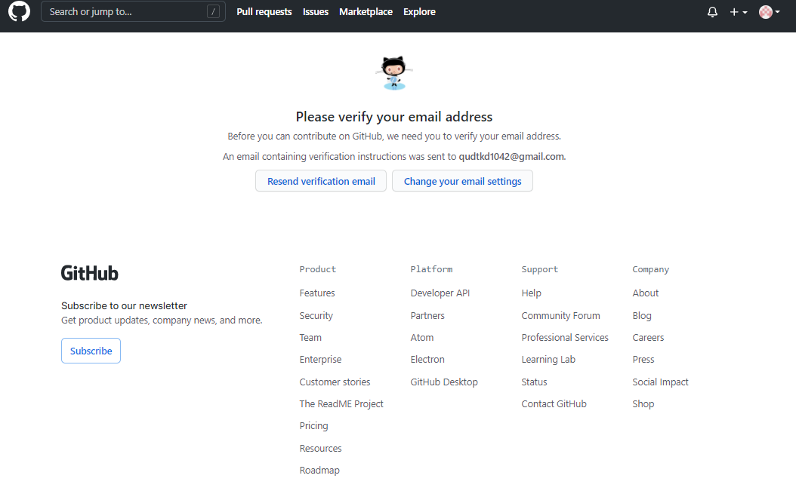
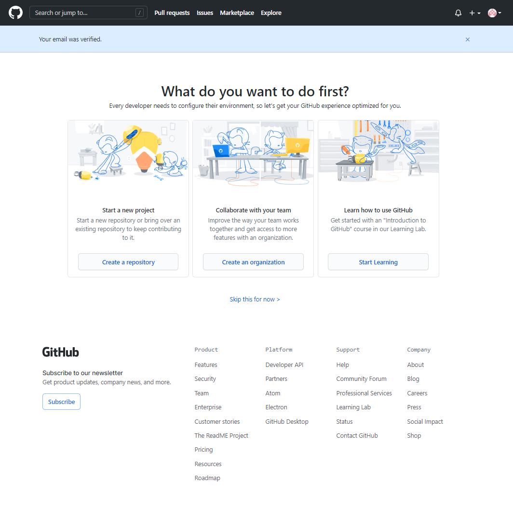

# 1.계정 생성 하기

1. Github 접속
    - Github Site (https://github.com/)

  

2. 각 항목에 알맞은 내용 입력
    - Username이랑 Email address를 입력하고 Password까지 입력 후 Verify your account를 고른 후 Create account

  

3. 본인 선호하는 항목 고르기
    - 그냥 다 무시하고 Complete setup만 선택해도 무관하다.

  

4. 메일 인증하기
    - 메일 인증하라고 하는데 본인이 등록한 이메일에 가서 메일을 확인해보고 없으면 Resend 한다.

  

5. 내 프로필 누를 때 생기는 일
    - 메일 인증을 안 하면 이런 문구가 발생하니 참고하자

  

6. 이메일 계정 Verify 하기
    - 메일 인증 확인 버튼을 눌러 진행하자

  

7. 메일 인증 후 나오는 화면
    - 메일 인증 확인 후 오른쪽 상단의 프로필 사진을 클릭하여 다음 단계로 넘어간다.

  

8. 여기가 가장 많이 볼 나의 깃허브 프로필 화면
    - 이쪽 화면을 꾸미고 싶다면 다른 블로그에서 소개하는 방식을 따라해보자. 왼쪽 깃허브 공식 아이콘을 클릭을 한번 해보자.

  

9. 여기에서 내가 구독하는 사람들 간 관련 이슈와 상세 알림을 확인할 수 있는 화면
    - 아직 내가 구독한 사람이나 관련 이슈들이 없어서 아무것도 안 나오지만 열심히 코딩하다 보면 어느새 가득 차 있을 것이다.

  

## 참고자료
1. 깃허브(GitHub) 회원 가입하기(계정 만들기) (https://goddaehee.tistory.com/218)