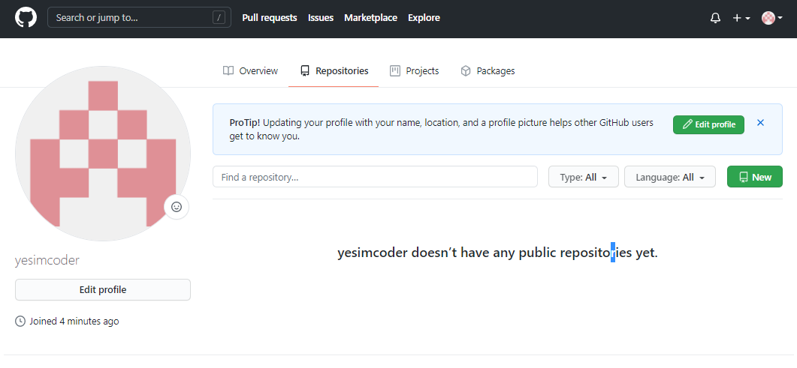
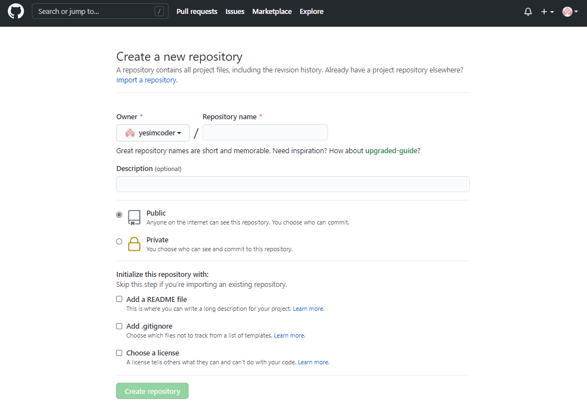
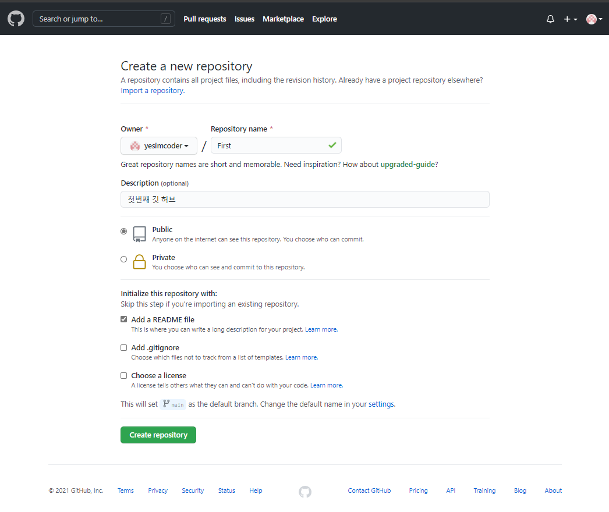
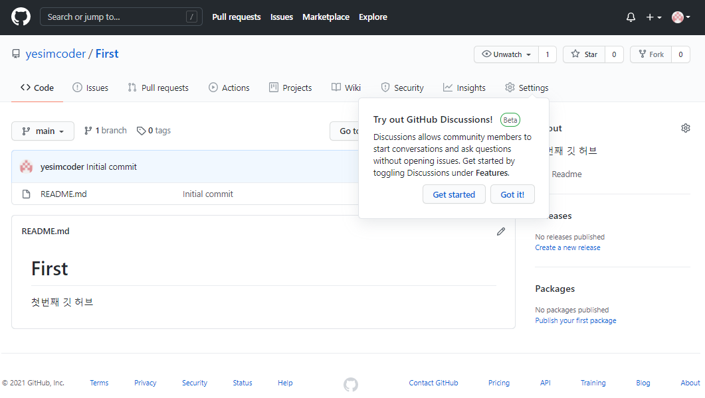

# 2.레포지토리 생성하기

1. 레포지토리 만들기 첫 번째 단계
    - 가운데 상단에 있는 repositories를 눌른다. 그 후 오른쪽에 있는 New 버튼을 누른다.

  

2. 레포지토리 이름 생성 및 부연 설명과 Readme.md 파일
    - 꼭 필수적으로 넣어야 하는 건 repositories 이름이고 이후에는 선택이지만 부연설명을 위해 공란에 내용을 적고 공개를 원하면 Public, 비밀을 원하면 Private를 누른다.

  

3. 전부 선택한 화면
    - 설정을 다 끝낸 화면이다. 좀 더 자세한 기능을 알고 싶다면 구글에 검색하길 바란다.

  

4. 완료된 화면
    - 제목으로 적은 First가 적힌 레포지토리 내용이 보이면서 안에 부연설명도 확인할 수 있다.

  

